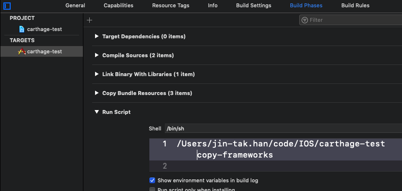

# Carthage 


### # create Cartfile

```matlab
(jin-tak.han)[ carthage-test ] $ touch Cartfile
```


### # edit Cartfile file

```matlab
(jin-tak.han)[ carthage-test ] $ ls
Cartfile		carthage-test
ReadMe.md		carthage-test.xcodeproj
(jin-tak.han)[ carthage-test ] $ cat Cartfile 
github "SwiftyJSON/SwiftyJSON" ~> 4.0
(jin-tak.han)[ carthage-test ] $ 
```


### #  carthage update

```matlab
(jin-tak.han)[ carthage-test ] $ carthage update
*** Cloning SwiftyJSON
*** Checking out SwiftyJSON at "4.2.0"
*** xcodebuild output can be found in /var/folders/rf/8vp_bqqd19d0ypywnd72wtxr0000gn/T/carthage-xcodebuild.JecXwz.log
*** Building scheme "SwiftyJSON macOS" in SwiftyJSON.xcworkspace
*** Building scheme "SwiftyJSON iOS" in SwiftyJSON.xcworkspace
*** Building scheme "SwiftyJSON tvOS" in SwiftyJSON.xcworkspace
*** Building scheme "SwiftyJSON watchOS" in SwiftyJSON.xcworkspace
(jin-tak.han)[ carthage-test ] $ 


or


(jin-tak.han)[ carthage-test ] $ carthage update --platform iOS
*** Fetching SwiftyJSON
*** Checking out SwiftyJSON at "4.2.0"
*** xcodebuild output can be found in /var/folders/rf/8vp_bqqd19d0ypywnd72wtxr0000gn/T/carthage-xcodebuild.GDONyk.log
*** Building scheme "SwiftyJSON iOS" in SwiftyJSON.xcworkspace
(jin-tak.han)[ carthage-test ] $ 
```


### #  link framework to Xcode

- drag SwiftyJSON.framework to General, linked framework

- build phase, plus -> run script

- type : /Users/jin-tak.han/code/IOS/carthage-test copy-frameworks

  

```matlab

```

