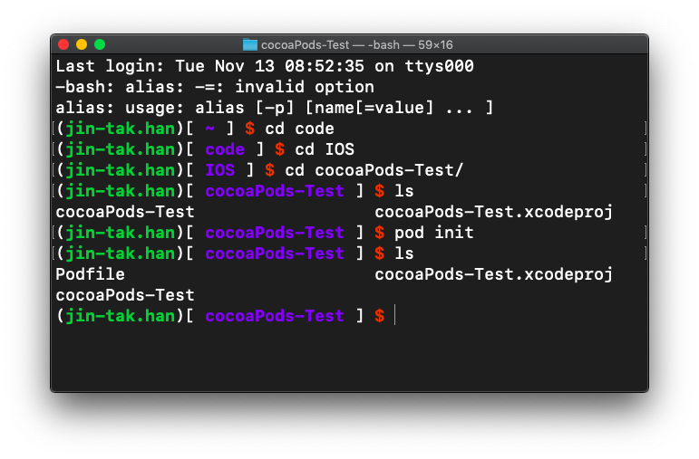
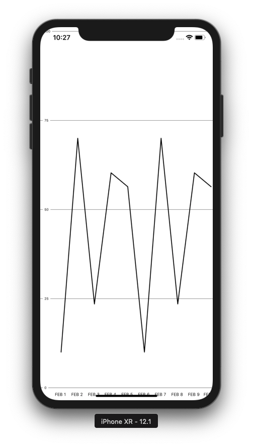

# Cocopods

### # init pod



### # edit profile file

- from (https://github.com/philackm/Scrollable-GraphView)

- add   pod 'ScrollableGraphView'

```matlab
# Uncomment the next line to define a global platform for your project
# platform :ios, '9.0'

target 'cocoaPods-Test' do
  # Comment the next line if you're not using Swift and don't want to use dynamic frameworks
  use_frameworks!
  pod 'ScrollableGraphView'

  # Pods for cocoaPods-Test

end

```


### # install pod

```matlab
install pod
```


### # result